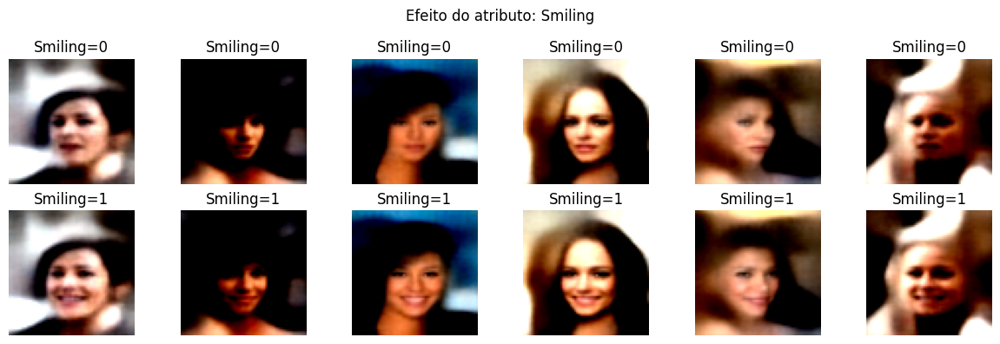
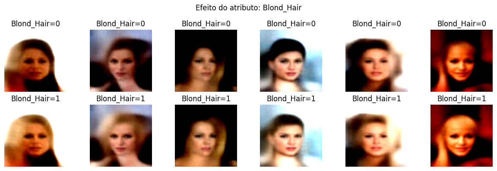
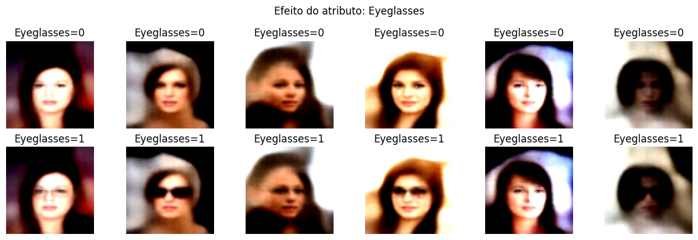

# faces
Generating faces with conditionals using cCVAE with CelebA Dataset.
This project was made for Generative AI subject in my grad. It was my very first time working with generative ai's model. I love it. Though it took me some hours of my sleep due to the deadline (waking up every 30 minutes see if it has finished training...)

For this project, we tried to generate faces with the following conditionals.

```python
["Smiling", "Male", "Blond_Hair", "Eyeglasses", "Wearing_Hat"]
```

Some of the best results are in the images bellow.


<br><br>

The dataset we are using is called CelebA. It's a:
```quote
CelebFaces Attributes Dataset (CelebA) is a large-scale face attributes dataset with more than 200K celebrity images, each with 40 attribute annotations. 
```


<br><br>
Due to the large size of the dataset, we implemented prefetching to improve the input pipeline performance during training:

```python
dataset = tf.data.Dataset.from_tensor_slices((image_paths, labels))
dataset = dataset.map(preprocess_pair, num_parallel_calls=tf.data.AUTOTUNE)
dataset = dataset.shuffle(buffer_size=10000)
dataset = dataset.batch(32)
dataset = dataset.prefetch(tf.data.AUTOTUNE)
```
